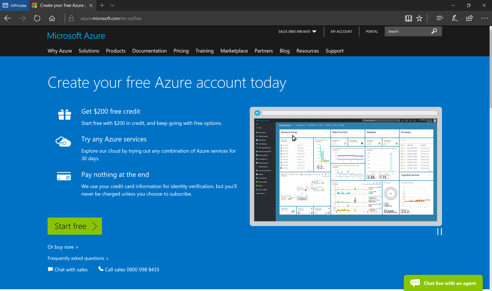
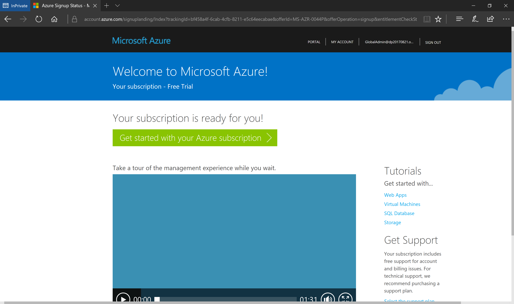

# Prepare Microsoft Azure Subscription
>Last update: 8/30/2017
>
>Author: [Dariusz Porowski](http://DariuszPorowski.MS/about/)

## Table of Contents
1. [Create a new Azure Active Directory tenant](#create-a-new-azure-active-directory-tenant)
2. [(Option 1) Activate a Microsoft Azure Pass subscription](#option-1-activate-a-microsoft-azure-pass-subscription)
3. [(Option 2) Activate a free Microsoft Azure Trial subscription](#option-2-activate-a-free-microsoft-azure-trial-subscription)

## Create a new Azure Active Directory tenant
1. Open a browser in **InPrivate** session, and navigate to [https://account.azure.com/organization](https://account.azure.com/organization)
2. Fill the form with your data (make sure a contact e-mail address, and a mobile number are not fake). Moreover, a domain name needs to be unique globally (for training purpose, you can use a pattern like **\<your initials\>\<today's date in YYYYMMDD format\>.onmicrosoft.com**, e.g., **jd20170821.onmicrosoft.com**). For user ID you can use, e.g., **GlobalAdmin**, then your Work account full name will be **GlobalAdmin@jd20170821.onmicrosoft.com**

3. Click **Continue**, and after your new Azure AD will be created, close the browser.

[Scroll to Top](#prepare-microsoft-azure-subscription)

## (Option 1) Activate a Microsoft Azure Pass subscription
1. Ask the Trainer for an activation code.
2. Open a browser in **InPrivate** session, and navigate to [https://www.microsoftazurepass.com/Home/HowTo](https://www.microsoftazurepass.com/Home/HowTo)
3. On **How To** page you will find all necessary information how to activate a new Microsoft Azure Pass subscription. For "Sign In" use your new Work account, created in previous step, e.g., **GlobalAdmin@jd20170821.onmicrosoft.com**

4. After successful Microsoft Azure subscription activation close the browser.

[Scroll to Top](#prepare-microsoft-azure-subscription)

## (Option 2) Activate a free Microsoft Azure Trial subscription
1. Open a browser in **InPrivate** session, and navigate to [https://azure.microsoft.com/en-us/free/](https://azure.microsoft.com/en-us/free)
2. Click on **Start free** button.

3. Sign In use your new Work account, created in previous step, e.g., **GlobalAdmin@jd20170821.onmicrosoft.com**

4. On **Free trial sign up** page fill the form with your data (make sure a contact e-mail address, and a mobile number are not fake). In this case, you need to provide valid credit card information to verify your identity. At the end click **Sign up** button.

5. Wait a few minutes until you see a page with the **Get started with your Azure subscription** button.

6. Close the browser.

[Scroll to Top](#prepare-microsoft-azure-subscription)