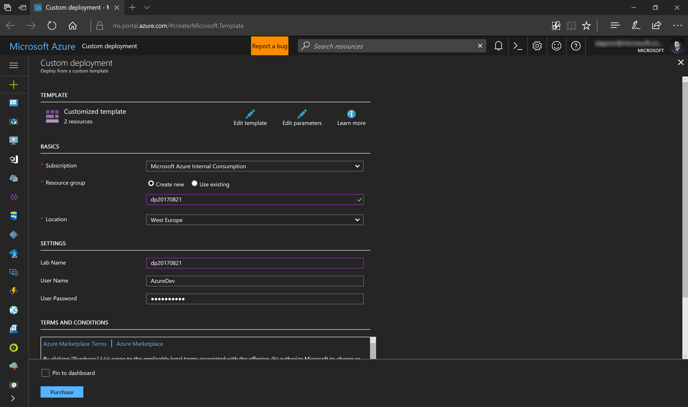
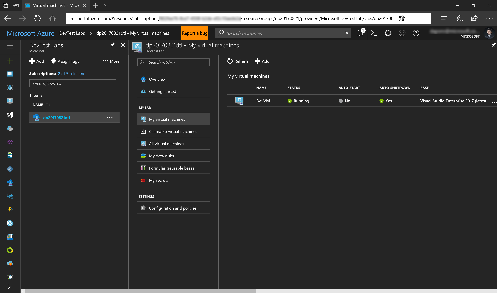
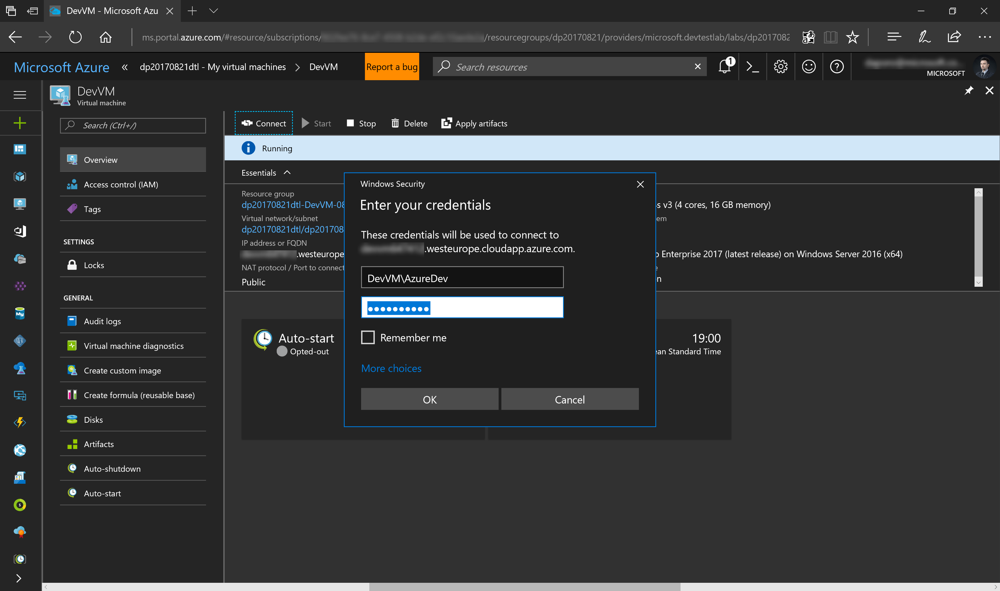

# Prepare development environment
>Last update: 8/30/2017
>
>Author: [Dariusz Porowski](http://DariuszPorowski.MS/about/)

## Exercises
This hands-on lab includes the following exercises:
* [Exercise 1A (Option 1): Deploy developer environment](#exercise-1a-option-1-deploy-developer-environment)
* [Exercise 1B (Option 2): Setup developer machine](#exercise-1b-option-2-setup-developer-machine)

Estimated time to complete this lab: **60** minutes.

## Exercise 1A (Option 1): Deploy developer environment
1. Click on **Deploy to Azure** button below.

2. Fill the parameters - for **Resource Group** select **Create new** and input name using a pattern like **\<your initials\>\<today's date in YYYYMMDD format\>**, e.g., **jd20170821**, set **Location** to **West Europe**, input name for **Lab Name** using the same pattern like for Resource Group, e.g., **jd20170821**. For **User Name** and **User Password** you can provide your values or use default: **AzureDev** and **Passw0rd1!**

3. Deployment process takes about 1 hour. After successful deployment go to **DevTest Labs** -> **\<your Lab Name\>dtl** (e.g. **jd20170821dtl**) -> **My virtual machines** -> **DevVM**

4. Click **Connect**, save and open RDP file, and login using default credentials: **DevVM\AzureDev** for username, and **Passw0rd1!** for password.

5. Verify that you can run Visual Studio. 

[Scroll to Top](#prepare-development-environment)

## Exercise 1B (Option 2): Setup developer machine
Coming soon...

[Scroll to Top](#prepare-development-environment)