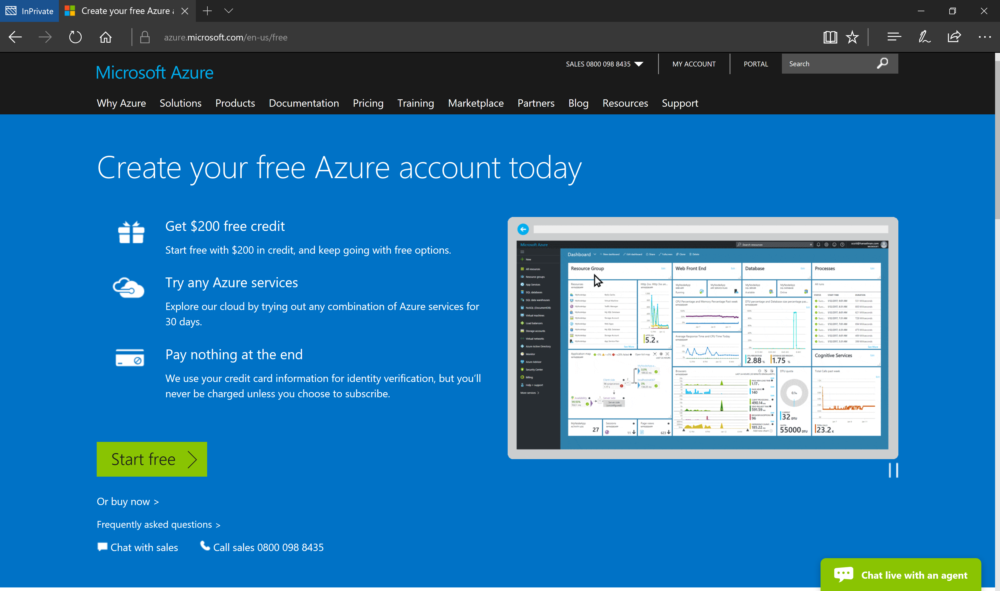

# Prepare development environment
>Last updated: 8/29/2017
>
>Author: Dariusz Porowski

## Table of Contents
1. [Create a new Azure Active Directory tenant](#create-a-new-azure-active-directory-tenant)
2. [(Option 1) Activate a Microsoft Azure Pass subscription](#option-1-activate-a-microsoft-azure-pass-subscription)
3. [(Option 2) Activate a free Microsoft Azure Trial subscription](#option-2-activate-a-free-microsoft-azure-trial-subscription)
4. [Deploy developer environment](#deploy-developer-environment)

## Create a new Azure Active Directory tenant
1. Open a browser in **InPrivate** session, and navigate to [https://account.azure.com/organization](https://account.azure.com/organization)
2. Fill the form with your data (make sure a contact e-mail address, and a mobile number are not fake). Moreover, a domain name needs to be unique globally (for training purpose, you can use a pattern like **\<your initials\>\<today's date in YYYYMMDD format\>.onmicrosoft.com**, e.g., **jd20170821.onmicrosoft.com**). For user ID you can use, e.g., **GlobalAdmin**, then your Work account full name will be **GlobalAdmin@jd20170821.onmicrosoft.com**

3. Click **Continue**, and after your new Azure AD will be created, close the browser.

## (Option 1) Activate a Microsoft Azure Pass subscription
1. Ask the Trainer for an activation code.
2. Open a browser in **InPrivate** session, and navigate to [https://www.microsoftazurepass.com/Home/HowTo](https://www.microsoftazurepass.com/Home/HowTo)
3. On **How To** page you will find all necessary information how to activate a new Microsoft Azure Pass subscription. For "Sign In" use your new Work account, created in previous step, e.g., **GlobalAdmin@jd20170821.onmicrosoft.com**

4. After successful Microsoft Azure subscription activation close the browser.

## (Option 2) Activate a free Microsoft Azure Trial subscription
1. Open a browser in **InPrivate** session, and navigate to [https://azure.microsoft.com/en-us/free/](https://azure.microsoft.com/en-us/free)
2. Click on **Start free** button.

3. Sign In use your new Work account, created in previous step, e.g., **GlobalAdmin@jd20170821.onmicrosoft.com**

4. On **Free trial sign up** page fill the form with your data (make sure a contact e-mail address, and a mobile number are not fake). In this case, you need to provide valid credit card information to verify your identity. At the end click **Sign up** button.

5. Wait a few minutes until you see a page with the **Get started with your Azure subscription** button.

6. Close the browser.

## Deploy developer environment
1. Click on **Deploy to Azure** button below.

2. Fill the parameters - for **Resource Group** select **Create new** and input name using a pattern like **\<your initials\>\<today's date in YYYYMMDD format\>**, e.g., **jd20170821**, set **Location** to **West Europe**, input name for **Lab Name** using the same pattern like for Resource Group, e.g., **jd20170821**. For **User Name** and **User Password** you can provide your values or use default: **AzureDev** and **Passw0rd1!**

3. Deployment process takes about 1 hour. After successful deployment go to **DevTest Labs** -> **\<your Lab Name\>dtl** (e.g. **jd20170821dtl**) -> **My virtual machines** -> **DevVM**

4. Click **Connect**, save and open RDP file, and login using default credentials: **DevVM\AzureDev** for username, and **Passw0rd1!** for password.

